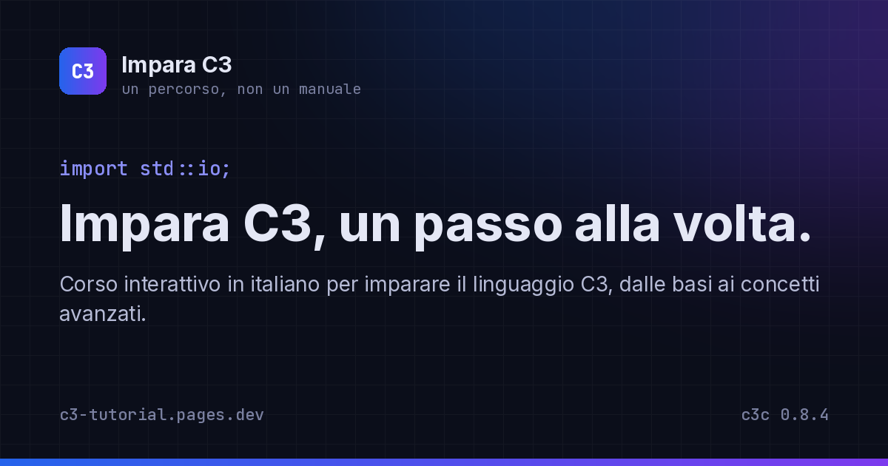

# Impara C3

**Un corso interattivo e gratuito, in italiano, per imparare il linguaggio [C3](https://c3-lang.org).**
Si legge qui: **[c3-tutorial.pages.dev](https://c3-tutorial.pages.dev)**

[](https://c3-tutorial.pages.dev)

C3 è l'evoluzione del C: stessa filosofia, meno trappole, più strumenti. Questo corso ti porta da
zero a programmatore con lezioni brevi, quiz nel browser ed esercizi da fare sul tuo computer. Niente
sandbox: il compilatore vero è il miglior insegnante.

È un corso **non ufficiale**, nato come studio personale per imparare bene la programmazione a basso
livello (memoria, tipi, puntatori, interazione con il C) e come esperimento con
[Claude Code](https://claude.com/claude-code): l'app e le lezioni sono state costruite passo passo
leggendo la documentazione ufficiale su [c3-lang.org](https://c3-lang.org).


## Cosa trovi

- **Lezioni brevi**, un'idea alla volta, con riquadri «Se vieni dal C» per chi conosce già il C e
  «Dettagli nerd» (chiusi di default) su come funziona davvero la macchina: buffer, byte, UTF-8,
  complemento a due...
- **Esempi verificati**: ogni programma e ogni output mostrato è stato compilato ed eseguito con
  `c3c 0.8.4` prima di finire in una lezione.
- **Quiz** dentro le lezioni ed **esercizi** da risolvere sul tuo computer, con soluzione.
- **Prontuario** (tasto `K`): parole chiave, tipi e sintassi viste finora, con ricerca.
- **Profilo** con progressi, tempo di studio, calendario e traguardi.
- **Temi e lettura su misura**: chiaro/scuro, palette alternative, font e dimensioni, animazioni
  riducibili. Interfaccia in italiano e in inglese; le lezioni sono in italiano.
- **Privacy**: niente cookie, niente tracciamento, niente account. I progressi restano nel tuo
  browser e si possono esportare o cancellare quando vuoi ([dettagli](https://c3-tutorial.pages.dev/privacy)).

| Una lezione | Il prontuario |
|---|---|
|  |  |

## Il programma

| # | Modulo | Di cosa parla |
|---|---|---|
| 1 | [Primi passi](https://c3-tutorial.pages.dev/modules/primi-passi) | Installare il compilatore, il primo programma, variabili, tipi, operatori e stampa |
| 2 | [Decisioni, cicli e funzioni](https://c3-tutorial.pages.dev/modules/decisioni-cicli-funzioni) | `if`, `switch`, `while`, `for`, `foreach` e le prime funzioni |
| 3 | [Array, slice e stringhe](https://c3-tutorial.pages.dev/modules/array-slice-stringhe) | Collezioni di valori, slice, testo da tagliare e costruire, liste che crescono |
| 4 | [Struct ed enum](https://c3-tutorial.pages.dev/modules/struct-ed-enum) | Tipi tuoi: struct, metodi, enum con dati associati, alias e typedef |

In arrivo: optional e gestione degli errori, moduli, memoria e puntatori, `defer` e contratti,
generics e macro, interoperabilità con il C.

## Scorciatoie da tastiera

Il corso si naviga anche solo con la tastiera. Le lettere non funzionano mentre stai scrivendo in un
campo di testo: premi `Esc` per uscirne.

| Tasto | Dove | Cosa fa |
|---|---|---|
| `K` | ovunque | Apre o chiude il **prontuario**: parole chiave e sintassi viste finora, con ricerca |
| `?` | ovunque | Mostra l'elenco delle scorciatoie |
| `T` | ovunque | Passa dal tema chiaro a quello scuro |
| `Esc` | ovunque | Chiude la finestra aperta |
| `Tab` / `Maiusc` + `Tab` | ovunque | Passa al link o pulsante successivo / precedente |
| `N` | nelle lezioni | Lezione successiva |
| `P` | nelle lezioni | Lezione precedente |
| `Invio` | negli esercizi | Verifica la risposta |

Lo stesso elenco è in **Impostazioni → Tastiera**, e con `?` da qualsiasi pagina.

## Hai trovato un errore?

Un esempio che non compila, una spiegazione poco chiara, un refuso: apri una
[issue](https://github.com/pankaspe/c3lang-guida-ita-sv/issues). Indica la lezione e, per il codice,
la versione di `c3c` che stai usando (`c3c --version`).

## Eseguirlo in locale

È un sito completamente statico fatto con SvelteKit 2 (Svelte 5), Tailwind 4 e mdsvex. Serve
[bun](https://bun.sh).

```sh
bun install
bun run dev      # sviluppo, http://localhost:5173
bun run check    # controllo dei tipi
bun run build    # sito statico in build/
```

Le lezioni sono file `.svx` (markdown con componenti) in `src/content/modules/`: aggiungere una
lezione non richiede di toccare il codice dell'app. Le immagini di anteprima per i link condivisi
(`static/og/`) si rigenerano con `python3 scripts/og-images.py` (serve Pillow). Le convenzioni per
scrivere le lezioni sono in [CLAUDE.md](CLAUDE.md).

---

© 2026 Pankaspe & Claude Code · Corso non ufficiale, basato sulla documentazione di
[c3-lang.org](https://c3-lang.org).
