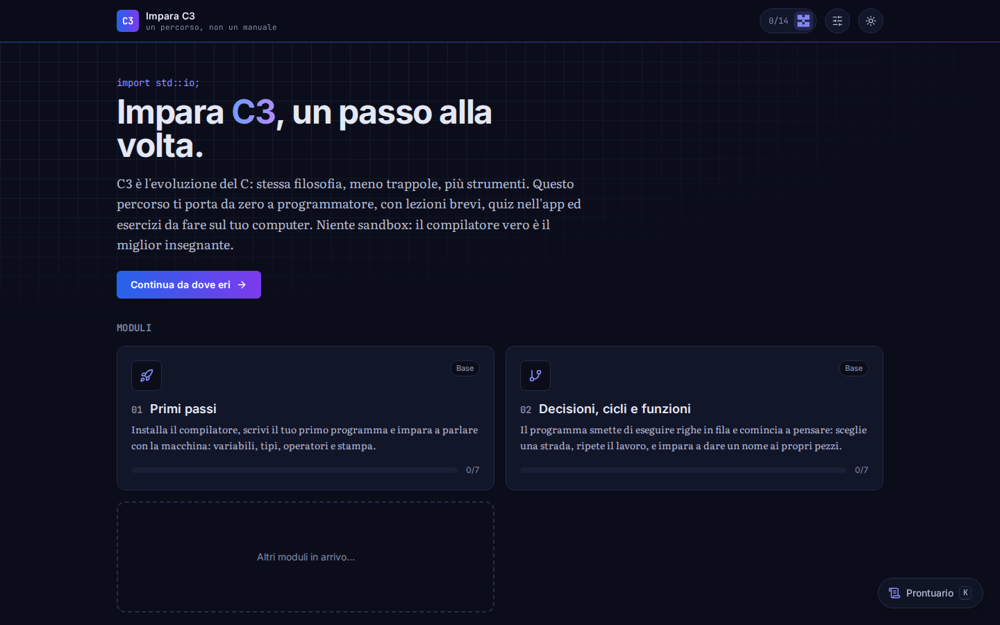
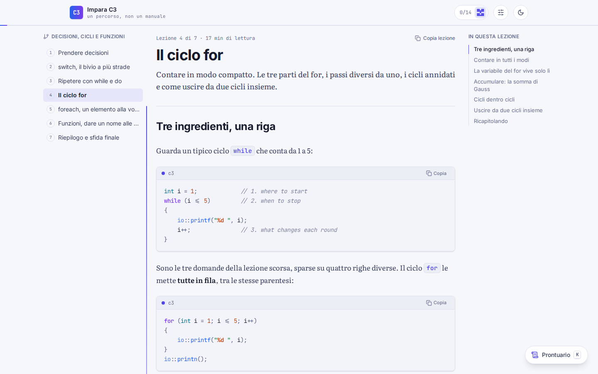
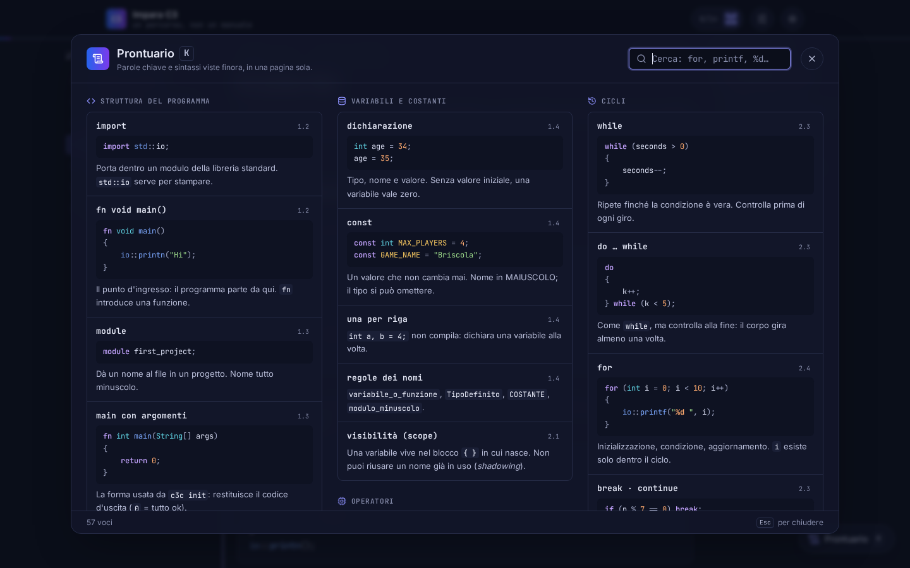

# Impara C3

Uno studio personale del linguaggio [C3](https://c3-lang.org) e della sua modernità, per imparare
bene la programmazione a basso livello: memoria, tipi, puntatori, interazione con il C.

È anche un esperimento con [Claude Code](https://claude.com/claude-code): l'app SvelteKit di
questo repository e il corso che contiene sono stati generati leggendo la guida ufficiale su
c3-lang.org e costruendo passo passo un percorso su misura. Ogni esempio è stato verificato con il
compilatore vero. Le lezioni sono in italiano; l'interfaccia è disponibile in italiano e in inglese.

| Una lezione | Il prontuario |
|---|---|
|  |  |

## Scorciatoie da tastiera

Il corso si naviga anche solo con la tastiera. Le lettere non funzionano mentre stai scrivendo in un
campo di testo: premi `Esc` per uscirne.

| Tasto | Dove | Cosa fa |
|---|---|---|
| `K` | ovunque | Apre o chiude il **prontuario**: parole chiave e sintassi viste finora, con ricerca |
| `?` | ovunque | Mostra l'elenco delle scorciatoie |
| `T` | ovunque | Passa dal tema chiaro a quello scuro |
| `Esc` | ovunque | Chiude la finestra aperta |
| `Tab` / `Maiusc` + `Tab` | ovunque | Passa al link o pulsante successivo / precedente |
| `N` | nelle lezioni | Lezione successiva |
| `P` | nelle lezioni | Lezione precedente |
| `Invio` | negli esercizi | Verifica la risposta |

Lo stesso elenco è in **Impostazioni → Tastiera**, e con `?` da qualsiasi pagina.
